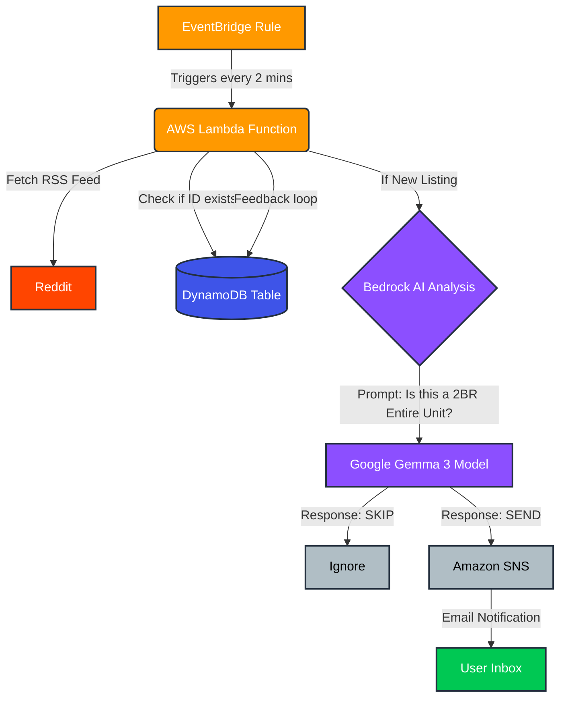

# 🔔 Reddit RSS Feed Keyword Monitor & AWS Notifier
### 🏙️ Specific Use Case: <br/> <br/> Finding a house in NYC sucks. I tried to fix it. <br/>Now i have no more excuse to find a house :)
---
<br/>


-blue)


## 📋 Overview

This is an **AWS-based automation tool** designed to solve a specific problem: finding a good apartment before anyone else does.

Instead of manually refreshing Reddit, this system acts as an **Intelligent RSS Feed Notifier**. It monitors specific Subreddits for keywords, uses **Google Gemma 3 (via AWS Bedrock)** to intelligently filter the content, and triggers an immediate **AWS SNS** email notification when a match is found.

**Key Features:**
* **RSS Monitoring:** Scrapes multiple Reddit RSS feeds (`r/NYCapartments`, `r/LeaseTakeoverNYC`) every 2 minutes.
* **Intelligent Filtering:** Uses an LLM (Google Gemma 3 12B) to analyze the *context* of a post (e.g., filtering out "looking for roommates" or "seeking advice" posts).
* **Deduplication:** Uses a DynamoDB table to ensure you never receive duplicate alerts.
* **Instant Notification:** Sends a clean, formatted email via Amazon SNS when a match is found.

## 🏗️ Architecture


## 🛠️ Prerequisites

To deploy this, you need:

* An **AWS Account** with access to the console.
* **Amazon Bedrock** enabled for the **Google Gemma 3 12B Instruct** model. I'm using us-east-2 region to make it crash even better next time AWS Implodes : D
* Basic familiarity with AWS Lambda and IAM Roles.

---

## 🚀 Deployment Guide (how to replicate it)

Follow these steps to set up your own instance of the notifier.

### 1. Database Setup (DynamoDB)
Create a table to store processed posts so the bot has a "memory".
* **Table Name:** `RedditSeenPosts`
* **Partition Key:** `post_id` (String)

### 2. Notification Setup (SNS)
Create the topic that will email you.
* **Topic Name:** `RedditApartmentAlerts`
* **Type:** Standard.
* **Subscription:** Create a subscription -> Protocol: `Email` -> Endpoint: `your-email@example.com`.
* **Important:** Check your inbox and click "Confirm Subscription" or the bot will fail.

### 3. AI Model Setup (Bedrock)
* Go to **Amazon Bedrock** > **Model catalog**.
* Select **Google Gemma 3 12B** and copy the Model ID (e.g., `google.gemma-3-12b-it`).

### 4. Permissions (IAM Role)
Create an IAM Role for the Lambda function.
* **Role Name:** `RedditScraper-Role`
* **Trust Policy:** Allow `lambda.amazonaws.com`.
* **Attached Policies:**
    * `AWSLambdaBasicExecutionRole`
    * `AmazonDynamoDBFullAccess` 
    * `AmazonSNSFullAccess`
* **Inline Policy (Custom):** Create a new inline policy for Bedrock.
```json
{
    "Version": "2012-10-17",
    "Statement": [
        {
            "Sid": "PermissionAI",
            "Effect": "Allow",
            "Action": [
                "bedrock:*"
            ],
            "Resource": "arn:aws:bedrock:us-east-2::foundation-model/google.gemma*"
        }
    ]
}
```

### 5. The Bot (Lambda Function)
Let's create the function that runs the code.
* **Function Name:** `RedditScraper`
* **Runtime:** Python 3.14 
* **Timeout:** Increase to **5 minutes**.
* **Environment Variables:**
    * `SNS_TOPIC_ARN`: `arn:aws:sns:us-east-2:YOUR_ACCOUNT_ID:RedditApartmentAlerts`
    * `TABLE_NAME`: `RedditSeenPosts`
* **Code:** Copy the content of `scraper.py` (provided in this repo) into the code editor. Save it and click on `Deploy`. 

### 6. Automation (EventBridge Trigger)
You can set the schedule directly from the Lambda console.

1. In the "Function Overview" section at the top, click **+ Add Trigger**.
2. Select **EventBridge (CloudWatch Events)** from the source list.
3. Under "Rule", select **Create a new rule**.
4. **Rule Name:** Enter something like `ApartmentBot_Schedule`.
5. **Schedule type:** Select **Schedule expression**.
6. Enter your desired frequency:
   * **Simple Rate:** `rate(2 minutes)` (Runs every 2 mins).

---

## 📂 Project Structure

```text
.
├── README.md             # This documentation
├── scraper.py            # Main Python source code for Lambda
```

## 🧠 How the AI Works

The core of this bot is **Google Gemma 3 (12B)**, running on Amazon Bedrock. Instead of simple keyword matching (which would fail on certain posts), the LLM reads the entire body of the filtered RSS Feed and then decides whether to send or not the e-mail.

### The Logic
We feed the Reddit post title and body into the LLM with a set of instructions. The LLM acts as a binary classifier, returning only `SEND` or `SKIP`.

### The Prompt
Here is the actual prompt used in the code to enforce our desired filters:

```python
prompt_text = f"""

You are an AI Real Estate Agent filtering NYC apartments.

TASK: Analyze this listing. Reply ONLY with "SEND" or "SKIP".

CRITERIA (All must be true for SEND):
1. It is a 2-Bedroom apartment (2BR, 2 Bed).
2. ENTIRE unit only (NO roommates, NO single rooms).
3. NOT asking for advice/feedback.
4. Location is NOT: Brooklyn, NJ, LIC, or Roosevelt Island.

LISTING:
Title: {title}
Body: {body}

RESPONSE:

"""
```
## ⚙️ Customization

You can easily adapt this bot for any housing search (e.g., *1-Bedroom in Brooklyn* or *Studios in Queens*). There are two steps to customize it.

### 1. Update the Search Source (RSS Feed)
The bot uses a specific RSS URL to fetch data. Edit it according to your preference. 

```python
# Old (2BR Search)
RSS_URL = "[https://www.reddit.com/r/LeaseTakeoverNYC+NYCapartments/search.rss?q=%28%222BR%22...&restrict_sr=1&sort=new](https://www.reddit.com/r/LeaseTakeoverNYC+NYCapartments/search.rss?q=%28%222BR%22...&restrict_sr=1&sort=new)"

# New (Your Custom Search e.g. 1BR)
RSS_URL = "[https://www.reddit.com/r/NYCapartments/search.rss?q=%221+Bedroom%22&restrict_sr=1&sort=new](https://www.reddit.com/r/NYCapartments/search.rss?q=%221+Bedroom%22&restrict_sr=1&sort=new)"
```

### 2. Update the AI Brain (Prompt)
The RSS feed fetches the candidates, but the AI decides which ones are "valid." You must update the prompt criteria to match your new search, or the AI might reject good listings.

- Open scraper.py.
- Find the prompt_text variable inside the ask_bedrock_analysis function.
- Edit the criteria list:

```python
prompt_text = f"""
CRITERIA (All must be true for SEND):
1. It is a 1-Bedroom apartment (1BR, 1 Bed).  <-- UPDATED CRITERIA
2. Location IS: Brooklyn.                     <-- UPDATED LOCATION
"""
```
## ✍️ Author
Luca Barattini <br/>

📧 lb3656@columbia.edu

Feel free to reach out if you have questions!

## 📜 License
This project is open-source and available under the MIT License.